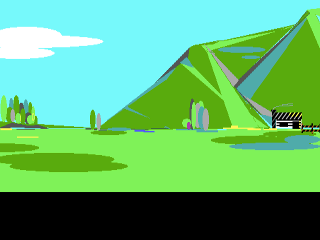

## RIPtermJS

By [Carl Gorringe](http://carl.gorringe.org)

#### Before the web, there was the BBS...

The [Remote Imaging Protocol](https://en.wikipedia.org/wiki/Remote_Imaging_Protocol) (RIP) was a vector graphics encoding used in [Bulletin Board Systems](https://en.wikipedia.org/wiki/Bulletin_board_system) (BBSs) during the 90's. To connect to a BBS, one would use a program called a _terminal_, and everything was text-based or used [ANSI escape codes](https://en.wikipedia.org/wiki/ANSI_escape_code) to position and color the text.

Then around 1992 a new standard for drawing graphics in the terminal was invented called RIP, also known as _RIPscrip_. It was designed in such a way to support existing BBS software, while adding vector graphics capability, such as drawing lines and shapes, similar to today's SVG format on the web. It could also draw buttons that when clicked, would simulate pressing a particular key on the keyboard. It gave a GUI interface to existing menus, and some games made use of it too. There was an [ANSI art](https://en.wikipedia.org/wiki/ANSI_art) scene where people made art out of colored text characters, and then there was a RIP art scene too.

The most popular terminal program for accessing RIP-enabled BBSs was an MS-DOS program called **RIPterm**, and the most popular version of RIPscrip was v1.54.  It used an EGA graphics mode with a resolution of 640 x 350 px and 16 colors (out of a wider palette). Since this didn't use a 4:3 aspect ratio, like 640 x 480 VGA and later resolutions, the pixels drawn weren't square.  Drawing on a modern screen thus involves either a squished canvas, or one stretched to make the pixels square.

**RIPtermJS** is my attempt at recreating a RIP file viewer drawn to an HTML **canvas** tag, as well as an experimental attempt to create a RIP to SVG converter.  Ultimately, I'd like to turn it into a terminal that one could use to access a RIP-enabled BBS from a website, possibly through a websocket interface.

## Status

#### Under Development

**RIPtermJS** will correctly display a number of v1.54 RIP files in a canvas, including using Flood Fill with patterns.

#### Still Todo:

* Filled Circles, Ovals, &amp; Pie Slices
* Drawing Text using .CHR fonts
* Text windows
* Buttons &amp; Mouse regions
* Loading &amp; drawing of Icons
* $ Variables

Visit my [demo page](http://carl.gorringe.org/pub/code/javascript/RIPtermJS/).

  

  

## License

Copyright (c) 2018 Carl Gorringe. All rights reserved.

Licensed under the the terms of the [GNU General Public License version 3 (GPLv3)](http://www.gnu.org/licenses/gpl-3.0.html).
